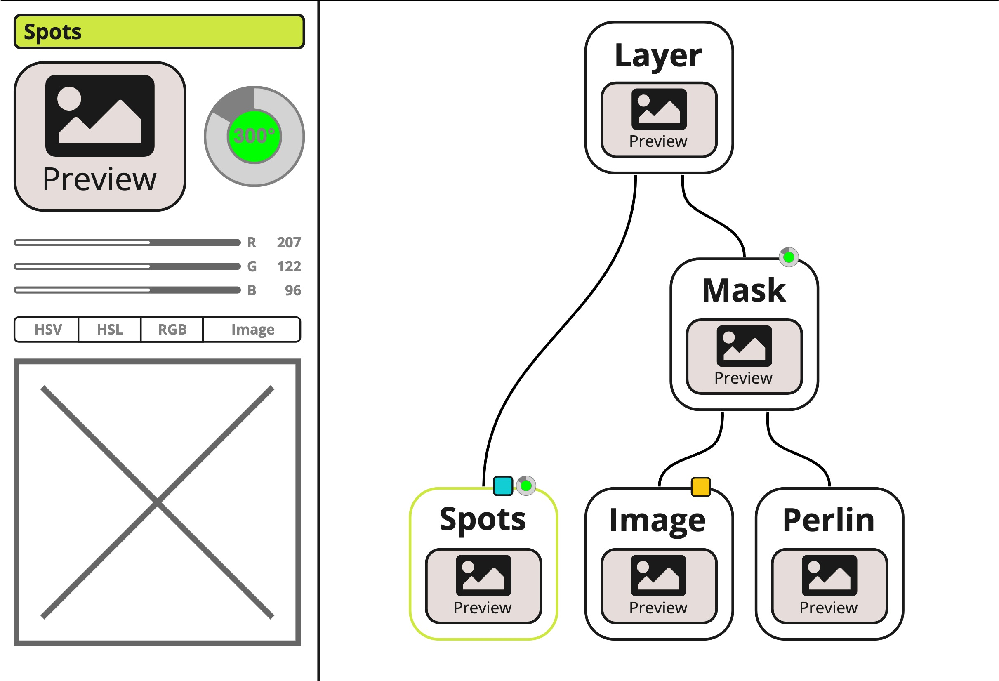

# SKOPPIG

## Primary idea

This project is based around building a webapp paint project with a node based brush editor allowing for the creation and (potentially heavy) optimisation of customised brushes.
Tools within the editor are based around these customised brushes made along with multiple sketching tools.

## Layout

The site can be separated into two main 'pages':

### A Canvas page

This page is where the actual drawing is done, making use of the brushes created

#### Brush

Just apply the brush to the created canvas

#### Fill

Flood fill an area by tiling a brush back to back and cropping

#### Smart Fill

Flood fill an area by using a [wfc](https://github.com/mxgmn/WaveFunctionCollapse) algorithm and cropping.

```ts
WFC_GPU(Canvas, Brush, N){
  let C = Canvas.size()[0]
  let B = Brush.size()[0]

  let Sides = new Array<Number /*B-N bit set*/, [(B-N)**2, 4]>()
  // Fill in the adjacency set

}
```

It might be possible to do wfc via GPU (for canvas size C, brush size B, section size S):

1. Precompute side hashes for each section of brush result - O((B/S)^2)
2. Whilst maximum entropy > 0
   1. Compute maximum + minimum entropy via GPU - O(logC)
   2. If each cell has entropy = the minimum entropy, mark cell to update - O(1)
   3. Whilst there are still cells to update

#### Ruler

Makes drawing straight lines easier by placing a limit on where can be drawn

### A Design page

This page is dedicated to designing custom brushes via a node based system



The node system primarily uses [beautiful-react-diagrams](https://github.com/antonioru/beautiful-react-diagrams) with the following edits made:

- Typescript typing has been introduced for schema components
- Additional config options have been added to the Diagram element
- Multiple graph algorithms have been added to the shared functions, to allow for folding of nodes
- Added options to provide custom port rendering (both via custom classNames and custom render functions)

The code for this modified version can be found in the `./lib/beautiful-react-diagrams` directory

## Getting Started

First, run the development server:

```bash
npm run dev
# or
yarn dev
```

Open [http://localhost:3000](http://localhost:3000) with your browser to see the result.

You can start editing the page by modifying `pages/index.js`. The page auto-updates as you edit the file.

[API routes](https://nextjs.org/docs/api-routes/introduction) can be accessed on [http://localhost:3000/api/hello](http://localhost:3000/api/hello). This endpoint can be edited in `pages/api/hello.js`.

The `pages/api` directory is mapped to `/api/*`. Files in this directory are treated as [API routes](https://nextjs.org/docs/api-routes/introduction) instead of React pages.

## Learn More

To learn more about Next.js, take a look at the following resources:

- [Next.js Documentation](https://nextjs.org/docs) - learn about Next.js features and API.
- [Learn Next.js](https://nextjs.org/learn) - an interactive Next.js tutorial.

You can check out [the Next.js GitHub repository](https://github.com/vercel/next.js/) - your feedback and contributions are welcome!

## Sources

- Diagramming
  - [beautiful-react-diagrams](https://github.com/antonioru/beautiful-react-diagrams)
- Modals
  - [Neumorphism_animation](https://codepen.io/ma_suwa/pens/showcase)
